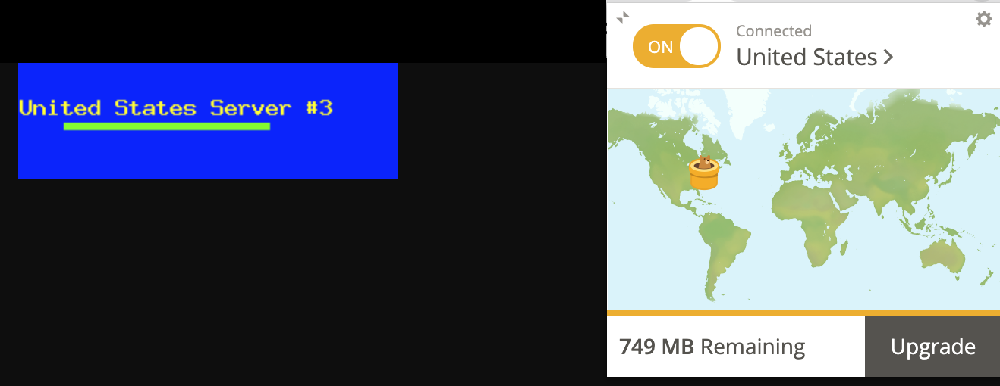
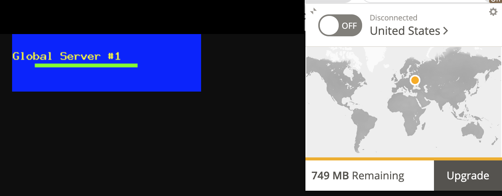

# HSA L11: Handmade CDN

## Overview
This is an example project to show how to create your own cdn for delivering millions of images across the globe.

## Getting Started

### Preparation
1. Install [Ngrok](https://ngrok.com/download) benchmarking tool. If you are using macOS, you can install it via brew
```bash
  brew install ngrok/ngrok/ngrok
```

2. Run the docker containers.
```bash
  docker-compose up -d
```

Be sure to use ```docker-compose down -v``` to clean up after you're done with tests.

## Test scenarios
### 1. Check different balancing approaches.
```bash
docker-compose run --rm siege -c1000 -t30s -b "http://cdn.example.com/image.png"
```

#### 1.1 Cache ON
```bash
Transactions:		       40762 hits
Availability:		      100.00 %
Elapsed time:		       29.26 secs
Data transferred:	       11.97 MB
Response time:		        0.70 secs
Transaction rate:	     1393.10 trans/sec
Throughput:		        0.41 MB/sec
Concurrency:		      978.03
Successful transactions:       40762
Failed transactions:	           0
Longest transaction:	        2.05
Shortest transaction:	        0.01
```

#### 1.2 Cache OFF. Default: Round Robin.
```bash
Transactions:		       39879 hits
Availability:		      100.00 %
Elapsed time:		       29.92 secs
Data transferred:	       11.55 MB
Response time:		        0.72 secs
Transaction rate:	     1332.85 trans/sec
Throughput:		        0.39 MB/sec
Concurrency:		      959.24
Successful transactions:       39879
Failed transactions:	           0
Longest transaction:	        7.63
Shortest transaction:	        0.00
```

#### 1.2 Cache OFF. Least connected
```bash
Transactions:		       39682 hits
Availability:		      100.00 %
Elapsed time:		       29.58 secs
Data transferred:	       11.49 MB
Response time:		        0.72 secs
Transaction rate:	     1341.51 trans/sec
Throughput:		        0.39 MB/sec
Concurrency:		      964.11
Successful transactions:       39682
Failed transactions:	           0
Longest transaction:	        7.46
Shortest transaction:	        0.00
```

#### 1.3 Cache OFF. Session persistence
```bash
Transactions:		       30507 hits
Availability:		      100.00 %
Elapsed time:		       29.68 secs
Data transferred:	        8.68 MB
Response time:		        0.58 secs
Transaction rate:	     1027.86 trans/sec
Throughput:		        0.29 MB/sec
Concurrency:		      594.24
Successful transactions:       30507
Failed transactions:	           0
Longest transaction:	       28.77
Shortest transaction:	        0.00
```

### 2. Check CDN.
2.1 With Enabled VPN: Location US
```bash
167.71.160.207 - - [21/Dec/2021:22:18:20 +0000] "GET /image.png HTTP/1.1" 200 376 "-" "Mozilla/5.0 (Macintosh; Intel Mac OS X 10_15_7) AppleWebKit/537.36 (KHTML, like Gecko) Chrome/96.0.4664.110 Safari/537.36" "167.71.160.207"
```


2.2 With Disabled VPN: Location UA
```bash
79.110.133.110 - - [21/Dec/2021:23:03:47 +0000] "GET /image.png HTTP/1.1" 200 376 "-" "Mozilla/5.0 (Macintosh; Intel Mac OS X 10_15_7) AppleWebKit/537.36 (KHTML, like Gecko) Chrome/96.0.4664.110 Safari/537.36" "79.110.133.110"
```


